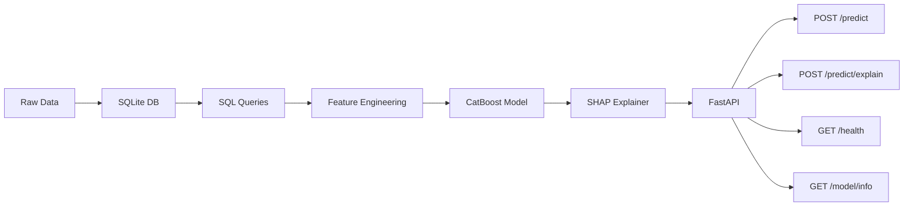

# Credit Risk API

Credit default scoring service: CatBoost classification, SHAP explanations, FastAPI.

## Architecture



## Status

The data layer is in place: German Credit is ingested into SQLite, accessed only through SQLAlchemy, validated, and covered by unit tests.

Feature engineering, model training, SHAP, the HTTP API, and Docker/CI are next. See [ROADMAP.md](ROADMAP.md).

## Tech Stack

| Component        | Technology                     |
|-----------------|--------------------------------|
| Data Storage    | SQLite (dev) / PostgreSQL (prod) |
| Data Processing | Pandas, SQLAlchemy             |
| ML Model        | CatBoost                       |
| Explainability  | SHAP                           |
| API Framework   | FastAPI                        |
| Validation      | Pydantic                       |
| Testing         | pytest                         |
| Containerization| Docker, Docker Compose         |
| CI/CD           | GitHub Actions                 |
| Package manager | uv                             |
| Linting         | Ruff, mypy                     |

## Quick Start

Requires [uv](https://docs.astral.sh/uv/).

```bash
git clone https://github.com/Eric-L-Manibardo/credit-risk-api.git
cd credit-risk-api

make dev          # .venv + dependencies
make ingest       # download extract → SQLite
make validate     # domain checks on the loans table
make test         # unit tests (in-memory SQLite)
make check        # lint + typecheck + tests
```

## Planned API

| Method | Endpoint            | Description                              |
|--------|---------------------|------------------------------------------|
| POST   | `/predict`          | Default probability + risk category      |
| POST   | `/predict/explain`  | Prediction + SHAP breakdown              |
| GET    | `/health`           | Health check                             |
| GET    | `/model/info`       | Model version, metrics, features used    |

## Project Structure

```
credit-risk-api/
├── data/                   # Local DB and raw extract (not committed)
│   └── raw/
├── src/
│   ├── data/               # Download, ingest, SQL access, validation
│   ├── features/           # Feature pipeline (upcoming)
│   ├── model/              # Training and registry (upcoming)
│   ├── explainability/     # SHAP (upcoming)
│   └── api/                # FastAPI (upcoming)
├── tests/
│   ├── unit/
│   └── integration/
├── models/                 # Serialized artifacts (.cbm), gitignored
├── pyproject.toml
├── uv.lock
├── Makefile
└── README.md
```

## Model Performance

To be published after training.

## License

MIT
