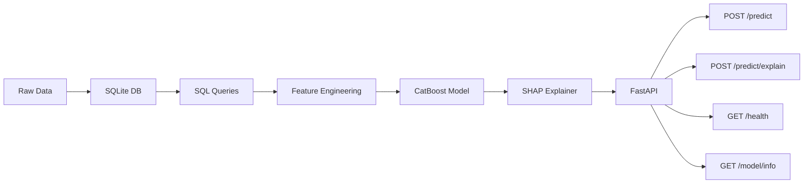

# Credit Risk API

A finished German Credit scoring API, and a Bondora loan book that is
still being read. The service (CatBoost, SHAP, FastAPI, Docker) scores
the 1994 proof of concept. It does not score Bondora.

## Architecture



## Status

| Book | Role in this repo | Status |
|------|-------------------|--------|
| German Credit | Served model: SQLite, CatBoost, SHAP, FastAPI | Finished |
| Bondora | Euro loans, 2009–2024. EDA before any schema | In progress |

### German Credit — finished

The proof of concept is ingested into SQLite, accessed only through
SQLAlchemy, validated, and transformed with a deterministic
`create_features` used for training and scoring.

A CatBoost baseline trains against a sealed test set with 5-fold stratified
cross-validation. `make train` writes `models/baseline-v1.cbm` (gitignored)
and `models/registry.json` (committed: metrics, features, operating point).
`make tune` searches hyperparameters on CV PR-AUC with the test set closed,
then persists the winner as `models/tuned-v1.cbm`. `make evaluate` reports
ranking, calibration, and cost-per-client at every decision threshold.

How the baseline behaves:
[docs/german_credit/baseline_evaluation.md](docs/german_credit/baseline_evaluation.md).
What the Optuna search changed:
[docs/german_credit/tuned-v1_evaluation.md](docs/german_credit/tuned-v1_evaluation.md).
How the model attributes a score:
[docs/german_credit/shap_explainability.md](docs/german_credit/shap_explainability.md).

The HTTP API serves health, model info, scoring, and per-application
SHAP for that model. A multi-stage image and GitHub Actions CI close
the loop. See [ROADMAP.md](ROADMAP.md).

### Bondora — in progress

Separate extract, not a second pass of the same pipeline. Notes so far:

- [1. What a row is](docs/bondora/eda1.md)
- [2. The clock stops](docs/bondora/eda2.md) — 2023 and 2024 are too young to compare
- [3. DefaultDate is not Status](docs/bondora/eda3.md) — working mark is collection within 12 months of `LoanDate`

The CSV stays local (`data/raw/LoanData.csv`, gitignored):

```bash
uv run python -m src.data.download bondora
```

A Kaggle token belongs in `~/.kaggle/access_token`, not in the repo.
No Bondora schema, model, or endpoint yet.

## Tech Stack

| Component        | Technology                     |
|-----------------|--------------------------------|
| Data Storage    | SQLite (dev) / PostgreSQL (prod) |
| Data Processing | Pandas, SQLAlchemy             |
| ML Model        | CatBoost                       |
| Explainability  | SHAP                           |
| API Framework   | FastAPI                        |
| Validation      | Pydantic                       |
| Testing         | pytest                         |
| Containerization| Docker, Docker Compose         |
| CI/CD           | GitHub Actions                 |
| Package manager | uv                             |
| Linting         | Ruff, mypy                     |

## Quick Start

Requires [uv](https://docs.astral.sh/uv/).

```bash
git clone https://github.com/Eric-L-Manibardo/credit-risk-api.git
cd credit-risk-api

make dev          # .venv + dependencies
make ingest       # download extract → SQLite
make validate     # domain checks on the loans table
make train        # CatBoost baseline → models/baseline-v1.cbm + registry.json
make tune         # Optuna on CV PR-AUC (sealed test closed) → models/tuned-v1.cbm
make evaluate     # classification report + figures in reports/figures/evaluation/
make explain      # SHAP figures in reports/figures/shap/ (rest pool, not test)
make run          # FastAPI on :8000 (needs the .cbm named in registry.json)
make docker-up    # same API in Compose (mounts ./models)
make test         # unit tests (in-memory SQLite)
make check        # lint + typecheck + tests
```

## API

`make run` serves all four endpoints. Open `/docs` for the interactive
schema.

A loan is never sent raw into the model. One request follows this path:

```
JSON body → Pydantic → create_features → as_catboost_frame
        → predict_proba  (+ TreeExplainer on /explain)  → JSON
```

| Step | What happens |
|------|----------------|
| JSON body | The client sends the application (income-style fields, amount, duration, …). There is **no** default label (`credit_class`): that is what we are estimating. |
| Pydantic | Checks types, allowed categories, and numeric ranges. An unknown checking-account status or an age of 12 stops here with **422**. Nothing is scored. |
| `create_features` | Adds the same derived columns used at training time (`credit_per_month`, `log_credit_amount`, `age_bin`). Train and serve must see the same columns. |
| `as_catboost_frame` | Casts categoricals to text. CatBoost (and SHAP) were trained on native categories, not one-hot encodings. |
| `predict_proba` | The model already loaded at startup returns **P(bad)**: the probability this applicant is a poor credit risk. |
| TreeExplainer | Only on `/predict/explain`. It does **not** return a plot. It returns numbers: how much each feature pushed the score, in log-odds. The waterfall picture is just those numbers drawn; the API returns the list. |
| JSON | `P(bad)` plus a decision at the registry threshold (`approve` / `review`). Explain adds `base_value`, `units: log_odds`, and `contributions`. |

`GET /health` only answers “is the process up and did the model load?”.
`GET /model/info` answers “which artifact, which threshold, which metrics?”.

| Method | Endpoint            | Description                              |
|--------|---------------------|------------------------------------------|
| POST   | `/predict`          | Default probability + risk category      |
| POST   | `/predict/explain`  | Prediction + SHAP breakdown              |
| GET    | `/health`           | Health check                             |
| GET    | `/model/info`       | Model version, metrics, features used    |

## Docker

The image is multi-stage: uv builds a production venv, the runtime is
`python:3.12-slim` plus `libgomp1` (CatBoost). Tests, the German Credit
extract, and the `.cbm` binary stay **out** of the image.

`registry.json` is copied in. The CatBoost file is bind-mounted from
`./models` (it is gitignored; train or tune locally first).

```bash
make tune         # writes models/tuned-v1.cbm + registry.json
make docker-up    # http://127.0.0.1:8000/health
```

Compose is `compose.yaml`. Stop with `make docker-down`.

## CI

Pull requests run [`.github/workflows/ci.yml`](.github/workflows/ci.yml):
Ruff, mypy, pytest, and `docker build`. The test suite trains a tiny
CatBoost in tmp; it does not download OpenML or need the production
`.cbm`.

## Dataset

The API trains on the OpenML German Credit extract (`credit-g`, 1994).
Columns such as `personal_status` (gendered marital status) and
`foreign_worker` are **features of that dataset, not a policy I would
deploy**. A production model in the EU would drop or tightly constrain
protected attributes. They remain in the schema so train, SHAP, and
`/predict` see the same published columns.

Bondora is a later euro consumer book (about 390,000 issued loans,
2009–2024, one snapshot on 23 May 2024). It is downloaded beside the
German extract and is not loaded into `data/credit.db`.

## Project Structure

```
credit-risk-api/
├── data/                   # Local DB and raw extract (not committed)
│   └── raw/
├── src/
│   ├── data/               # Download, ingest, SQL access, validation
│   ├── features/           # Deterministic feature transform
│   ├── model/              # Split protocol, metrics, training, evaluation
│   ├── explainability/     # SHAP (log-odds TreeExplainer)
│   └── api/                # FastAPI (health, info, predict, explain)
├── tests/
│   ├── unit/
│   └── integration/
├── docs/                   # Public notes: german_credit/ and bondora/
├── scripts/                # Bondora EDA (German Credit uses make / src/)
├── models/                 # {version}.cbm (gitignored) + registry.json
├── Dockerfile
├── compose.yaml
├── .github/workflows/ci.yml
├── pyproject.toml
├── uv.lock
├── Makefile
└── README.md
```

## Model Performance

German Credit only. The served artifact is `tuned-v1` (20 Optuna trials,
objective = mean 5-fold PR-AUC). Operating point is still 0.5; the
Hofmann-cost optimum (0.25) is a product decision, not applied yet.

| Metric | Baseline CV | Tuned CV | Tuned test |
|---|---|---|---|
| ROC-AUC | 0.788 ± 0.024 | 0.792 ± 0.021 | 0.774 |
| PR-AUC | 0.609 ± 0.047 | **0.633 ± 0.065** | 0.674 |
| Brier | 0.179 ± 0.004 | 0.184 ± 0.010 | 0.191 |
| Recall (`bad`) @ 0.5 | 0.694 ± 0.078 | 0.741 ± 0.102 | 0.689 |
| Cost / client @ 0.5 | 0.635 ± 0.088 | 0.595 ± 0.111 | 0.673 |

The search improved the metric it was allowed to see (CV PR-AUC). Test
PR-AUC moved 0.692 → 0.674; with ~45 defaults that is inside the noise,
so it does not veto the winner. Full manifest:
[models/registry.json](models/registry.json).

- Baseline figures: [docs/german_credit/baseline_evaluation.md](docs/german_credit/baseline_evaluation.md)
- Tuned-v1 figures and Optuna search: [docs/german_credit/tuned-v1_evaluation.md](docs/german_credit/tuned-v1_evaluation.md)
- SHAP (log-odds, rest pool): [docs/german_credit/shap_explainability.md](docs/german_credit/shap_explainability.md)
- Bondora 1, what a row is: [docs/bondora/eda1.md](docs/bondora/eda1.md)
- Bondora 2, the clock: [docs/bondora/eda2.md](docs/bondora/eda2.md)
- Bondora 3, DefaultDate is not Status: [docs/bondora/eda3.md](docs/bondora/eda3.md)

## License

MIT
