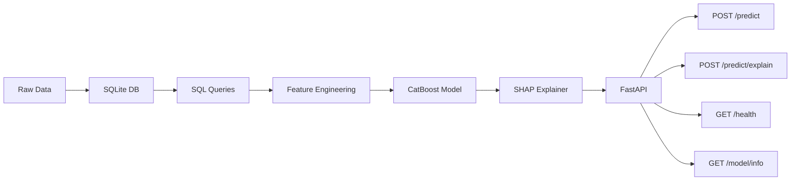

# Credit Risk API

Credit default scoring service: CatBoost classification, SHAP explanations, FastAPI.

## Architecture



## Status

The data layer and feature pipeline are in place: German Credit is ingested
into SQLite, accessed only through SQLAlchemy, validated, and transformed
with a deterministic `create_features` used for training and scoring.

A CatBoost baseline trains against a sealed test set with 5-fold stratified
cross-validation. `make train` writes `models/baseline.cbm` (gitignored) and
`models/registry.json` (committed: metrics, features, operating point).
`make tune` searches hyperparameters on CV PR-AUC with the test set closed,
then persists the winner. `make evaluate` reports ranking, calibration, and
cost-per-client at every decision threshold.

How the baseline behaves:
[docs/baseline_evaluation.md](docs/baseline_evaluation.md).
What the Optuna search changed:
[docs/tuned-v1_evaluation.md](docs/tuned-v1_evaluation.md).

SHAP, the HTTP API, and Docker/CI are next. See [ROADMAP.md](ROADMAP.md).

## Tech Stack

| Component        | Technology                     |
|-----------------|--------------------------------|
| Data Storage    | SQLite (dev) / PostgreSQL (prod) |
| Data Processing | Pandas, SQLAlchemy             |
| ML Model        | CatBoost                       |
| Explainability  | SHAP                           |
| API Framework   | FastAPI                        |
| Validation      | Pydantic                       |
| Testing         | pytest                         |
| Containerization| Docker, Docker Compose         |
| CI/CD           | GitHub Actions                 |
| Package manager | uv                             |
| Linting         | Ruff, mypy                     |

## Quick Start

Requires [uv](https://docs.astral.sh/uv/).

```bash
git clone https://github.com/Eric-L-Manibardo/credit-risk-api.git
cd credit-risk-api

make dev          # .venv + dependencies
make ingest       # download extract → SQLite
make validate     # domain checks on the loans table
make train        # CatBoost baseline → models/baseline.cbm + registry.json
make tune         # Optuna on CV PR-AUC (sealed test closed), then persist winner
make evaluate     # classification report + figures in reports/figures/
make test         # unit tests (in-memory SQLite)
make check        # lint + typecheck + tests
```

## Planned API

| Method | Endpoint            | Description                              |
|--------|---------------------|------------------------------------------|
| POST   | `/predict`          | Default probability + risk category      |
| POST   | `/predict/explain`  | Prediction + SHAP breakdown              |
| GET    | `/health`           | Health check                             |
| GET    | `/model/info`       | Model version, metrics, features used    |

## Project Structure

```
credit-risk-api/
├── data/                   # Local DB and raw extract (not committed)
│   └── raw/
├── src/
│   ├── data/               # Download, ingest, SQL access, validation
│   ├── features/           # Deterministic feature transform
│   ├── model/              # Split protocol, metrics, training, evaluation
│   ├── explainability/     # SHAP (upcoming)
│   └── api/                # FastAPI (upcoming)
├── tests/
│   ├── unit/
│   └── integration/
├── docs/                   # Evaluation notes and curated figures
├── models/                 # baseline.cbm (gitignored) + registry.json
├── pyproject.toml
├── uv.lock
├── Makefile
└── README.md
```

## Model Performance

Current artifact is `tuned-v1` (20 Optuna trials, objective = mean 5-fold
PR-AUC). Operating point is still 0.5; the Hofmann-cost optimum (0.25) is
a product decision, not applied yet.

| Metric | Baseline CV | Tuned CV | Tuned test |
|---|---|---|---|
| ROC-AUC | 0.788 ± 0.024 | 0.792 ± 0.021 | 0.774 |
| PR-AUC | 0.609 ± 0.047 | **0.633 ± 0.065** | 0.674 |
| Brier | 0.179 ± 0.004 | 0.184 ± 0.010 | 0.191 |
| Recall (`bad`) @ 0.5 | 0.694 ± 0.078 | 0.741 ± 0.102 | 0.689 |
| Cost / client @ 0.5 | 0.635 ± 0.088 | 0.595 ± 0.111 | 0.673 |

The search improved the metric it was allowed to see (CV PR-AUC). Test
PR-AUC moved 0.692 → 0.674; with ~45 defaults that is inside the noise,
so it does not veto the winner. Full manifest:
[models/registry.json](models/registry.json).

- Baseline figures: [docs/baseline_evaluation.md](docs/baseline_evaluation.md)
- Tuned-v1 figures and Optuna search: [docs/tuned-v1_evaluation.md](docs/tuned-v1_evaluation.md)

## License

MIT
