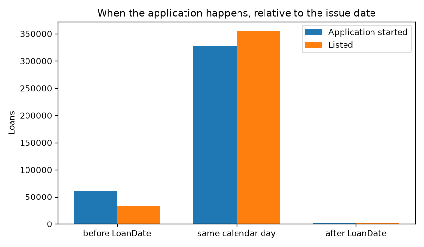

# Bondora extract: what a row is

Note 1 of the Bondora loan book (`data/raw/LoanData.csv`). Next:
[the clock](eda2.md). The German Credit reports next door score a
1,000-row textbook sample.
This file is a euro consumer book, photographed once, and it is not a
model yet.

Counts below come from `uv run python scripts/bondora_step1_grain.py`.
The sealed-test protocol of the German Credit API does not apply here.

## One snapshot, one issued loan

389,524 rows. `ReportAsOfEOD` is a single value, **2024-05-23**. There
is no row per loan per month. Anything that happens after that day is
not in the file.

`LoanId` is unique. `Amount` is never missing and never ≤ 0. A row is
a loan that was funded. Applications that were refused are not here.

## A person is not a row

165,396 distinct `PartyId` values sit behind those loans.

| People | Loans each |
| ------ | ---------- |
| 85,849 | 1          |
| 79,547 | 2 or more  |

The maximum is 75 loans for one person. A later train/test split that
cuts rows at random can put the same borrower on both sides.

## The application is not the loan

`LoanApplicationStartedDate` is when the application started, with a
clock time. `LoanDate` is the day the loan was issued,      at
midnight. `ListedOnUTC` is when it appeared on the market.

Comparing the timestamps makes the application look later than the
loan, because midnight is earlier than the afternoon of the same day.
On the calendar the two events are almost the same day:

|                     | Before`LoanDate` | Same calendar day | After`LoanDate` |
| ------------------- | -----------------: | ----------------: | ----------------: |
| Application started |             60,794 |           327,404 |             1,326 |
| Listed              |             33,089 |           355,103 |             1,332 |

The 1,326 applications that fall on a later calendar day are dirt or a
rare case. They do not make this file an application funnel.

## The signed maturity is not the maturity on the photo

`MaturityDate_Original` is the schedule at issuance.
`MaturityDate_Last` is the schedule on 23 May 2024.

|                                |   Loans |
| ------------------------------ | ------: |
| Unchanged                      | 225,154 |
| Extended                       | 142,894 |
| of which by more than 60 days  | 137,718 |
| Shortened                      |  21,476 |
| Extended by more than 10 years |   6,008 |

The last bucket is broken dates, not a real term. A description of the
loan that was signed uses the original maturity. The last maturity
describes the book on the day of the snapshot.

## `ContractEndDate` is not "this loan is closed"

The column is empty on 286,513 rows (73.6%). Of the 103,011 filled
values, 67,866 fall on or before the snapshot and 35,145 fall after it
(median about 450 days later). A field defined as the day the contract
ended should not sit in the future. Empty does not mean closed, and a
future date does not mean open, until it is read next to `Status`.

## What this note does not decide

It does not define default, compare countries, or train a model.
`DefaultDate` is the day collection started. It is not `Status`, and it
is not a loss. Next: [the clock](eda2.md). The default cross-tab comes
after that.
