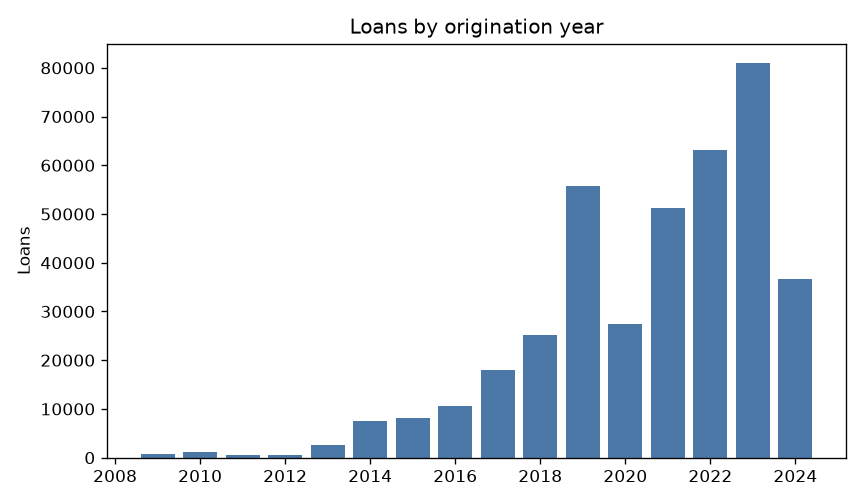
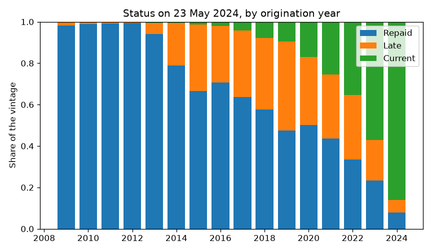
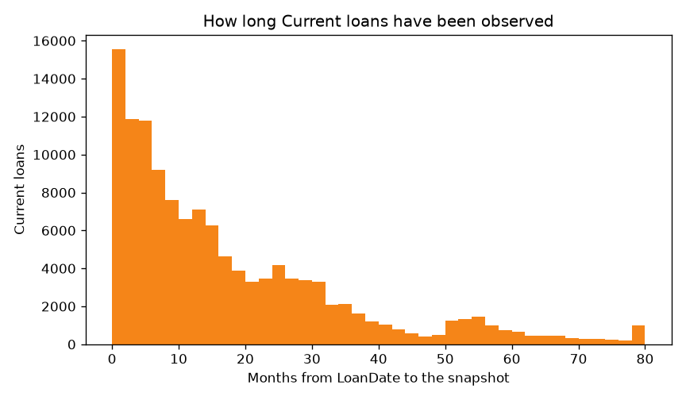

# Bondora extract: the clock stops

Note 2 of the Bondora loan book. Read [what a row is](eda1.md) first.
This note says how long each row has been watched.

The snapshot is **23 May 2024**. Observation time is that date minus
`LoanDate`. It is not `ContractEndDate`: that field is empty on paid
loans and sometimes sits in the future. Counts come from
`uv run python scripts/bondora_step2_clock.py`.

## The book is not one cohort

Origination runs from 2009 to the day of the snapshot. Early years are
a few hundred loans. From 2019 the book is large: 55,839 loans in 2019,
80,923 in 2023, 36,646 in the first months of 2024.

## `Current` is not a good outcome

`Status` is the state on the snapshot day. A 2016 loan that is still
`Current` has been paid for years. A 2024 loan that is `Current` has
been watched for about two months. Same label, different fact.

| Year | Loans | % `Current` | % watched &lt; 12 months | % still before the signed maturity |
|-----:|------:|------------:|-------------------------:|-----------------------------------:|
| 2018 | 25,103 | 7.7 | 0 | 0 |
| 2019 | 55,839 | 9.5 | 0 | 41 |
| 2020 | 27,519 | 16.9 | 0 | 64 |
| 2021 | 51,226 | 25.5 | 0 | 82 |
| 2022 | 63,078 | 35.3 | 0 | 90 |
| 2023 | 80,923 | 57.0 | 58.5 | 92 |
| 2024 | 36,646 | 86.0 | 100 | 100 |

Through 2018 the maturity that was signed has already passed. From 2019
a growing share of that term falls after the photo. The median term on
this book is 60 months, so a loan from mid-2019 matures right around
this snapshot.

There are 126,065 `Current` loans. Their median time on book is 12
months. The lower quartile is 4.7 months. The shortest was issued on
the snapshot day.

## What is left out of a rate

**2023 and 2024 are out of any rate that gets compared.** Every 2024
loan has been watched for less than a year (median `Current` loan: 2
months). In 2023, 58.5 % are under 12 months. The drop in crude default
in those two years is the clock, not a better book.

**2009–2022 have had at least 12 months.** An early default has had
time to show up. They are not a finished book: in 2022, 90 % are still
before the signed maturity and 35 % are `Current`. A rate of "ever
defaulted by the photo" still gives old vintages more months in which
to fail. Later comparisons use 2009–2022. A 12-month default can
include 2022. A "the loan ended badly" label cannot: 2022 has not ended.

The default label is [note 3](eda3.md). `DefaultDate` is the day
collection started. It is not `Status`.
