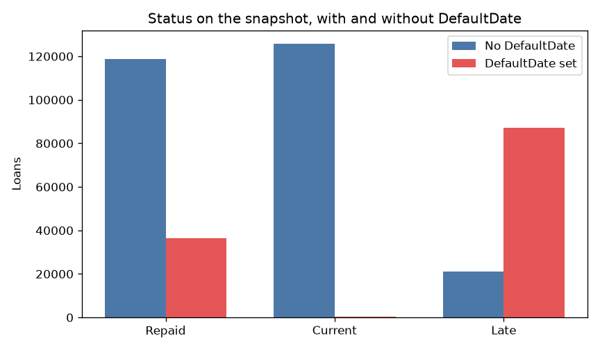
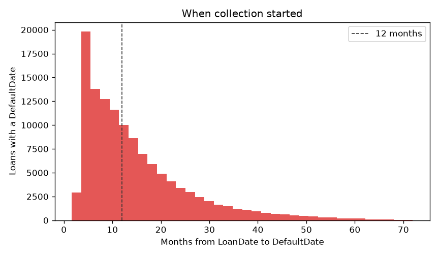
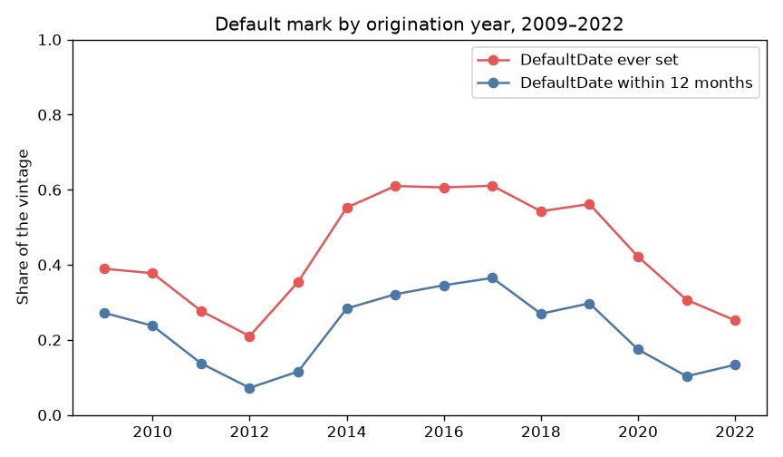

# Bondora extract: DefaultDate is not Status

Note 3 of the Bondora loan book. Read [the clock](eda2.md) first.
This note says what `DefaultDate` counts, and which working mark the
later charts will share. That mark is not the model target.

Counts come from
`uv run python scripts/EDA_bondora/bondora_step3_label.py`.

## The two fields disagree

`Status` is the state on 23 May 2024. `DefaultDate` is the day Bondora
started collection. The date stays if the borrower later catches up.
124,128 loans have a date. None of those dates fall before `LoanDate`
or after the snapshot.

| Status | `DefaultDate` set | `DefaultDate` empty |
|--------|------------------:|--------------------:|
| Repaid | 36,530 | 118,744 |
| Current | 383 | 125,682 |
| Late | 87,215 | 20,970 |

A repaid loan with a date entered collection and then paid. A current
loan with a date went to collection and was back on schedule by the
photo. There are 383 of those.

## Collection usually starts around the first year

Among loans with a date, the median time from `LoanDate` is 11.2 months
for `Repaid` and 11.7 months for `Late`. 0.2% start within 3 months,
21% by month 6, 52% by month 12, 83% by month 24. The figure shows the
first 72 months. The longest gap in the file is 137 months.

A rate of "ever had a `DefaultDate`" gives a 2016 vintage years that a
2022 vintage has not had. Note 2 already left 2023 and 2024 out for
that reason. Inside 2009–2022 the same gap remains, smaller.

## The platform's own wait got longer

`DebtOccuredOn` is the day the debt was recorded. On the 118,094 loans
that have both dates, the median wait until `DefaultDate` is 62 days
through 2015, 76 days in 2016, and 92–94 days from 2020 on. 6,034 dated
loans have no `DebtOccuredOn`. 0.3% of the gaps that exist are
negative, so a few rows are messy. The yearly median is the stable
part: the day this file calls default is not the same distance from
first arrears in 2014 and in 2022.

## Late with no date is mostly early arrears

20,970 loans are `Late` with no `DefaultDate`. Median days past due on
the photo: 19. 12.7% (about 2,660) are at 60 days or more. The rest
are still inside the window the platform has not called collection.
They stay out of the working mark. The long-arrears slice stays in
view for the closing note.

## Working mark for the next charts

**Collection started within 12 months of `LoanDate`.**

On the 271,955 loans originated in 2009–2022 — every one of them
watched at least 12 months — that is 57,625 loans, **21.2%**. Of those,
38,309 are still `Late`, 19,256 later `Repaid`, and 60 are `Current`.

| Year | % `DefaultDate` ever | % within 12 months |
|-----:|---------------------:|-------------------:|
| 2014 | 55.2 | 28.4 |
| 2015 | 61.0 | 32.2 |
| 2016 | 60.6 | 34.6 |
| 2017 | 61.1 | 36.5 |
| 2018 | 54.3 | 27.0 |
| 2019 | 56.2 | 29.7 |
| 2020 | 42.2 | 17.4 |
| 2021 | 30.7 | 10.3 |
| 2022 | 25.2 | 13.4 |

The blue line is what the country and association notes will use,
inside one origination year. The red line sits higher on older
vintages because defaults after month 12 have had time to arrive.
2009–2013 are on the figure and are small vintages. 2023 and 2024 stay
off it. In 2023 only 33,587 of 80,923 loans have been watched 12
months; on that slice the 12-month rate is 13.8%, close to 2022, while
the crude rate on all of 2023 is 9.5%.

`Restructured` is a schedule change: 137,718 loans. 83,376 of them have
no `DefaultDate`. It is not this mark.

The 12-month flag keeps the next charts on one definition. The label a
model would defend is the closing note, with this table in front of it.
