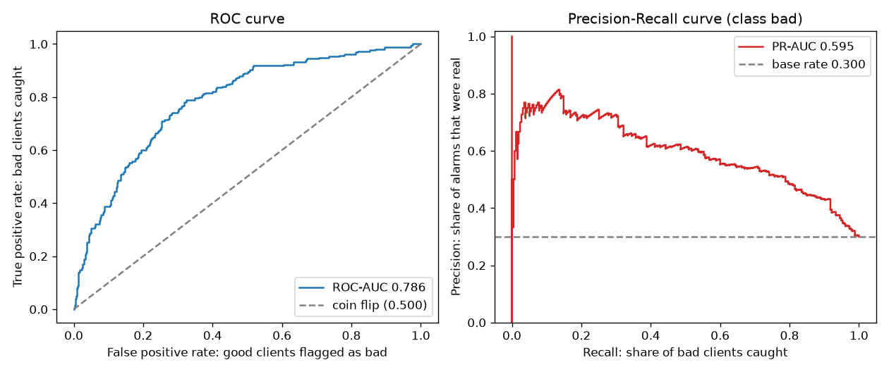
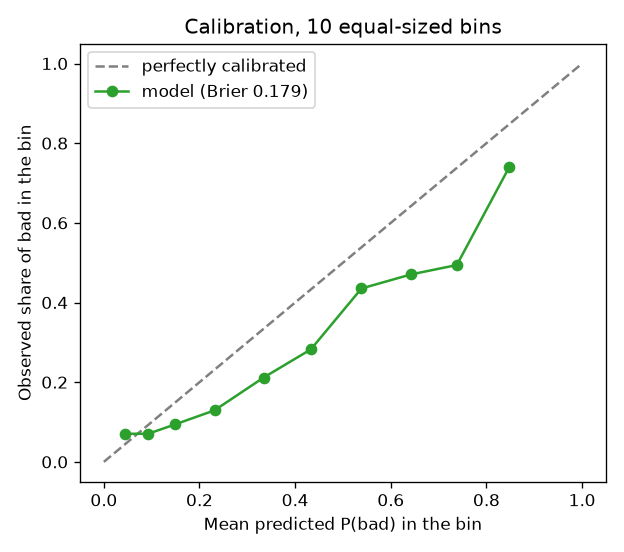
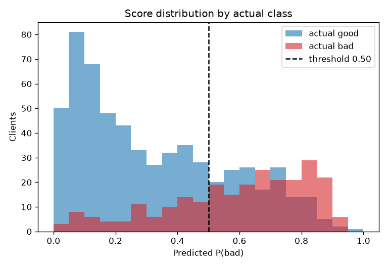
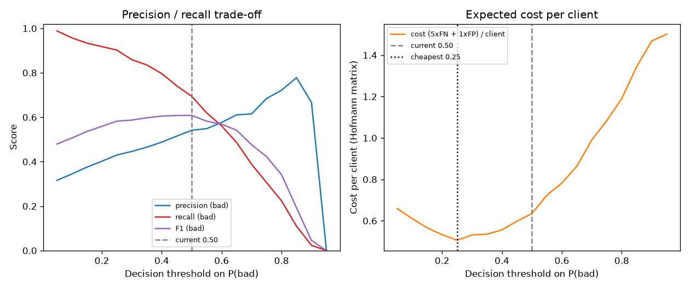

# Baseline evaluation notes

Working notes on how the first CatBoost baseline behaves and what I plan to
change next. Figures are regenerated with `make evaluate`; the copies here
are the ones worth keeping.

## What I measure

The dataset is small (1000 loans, 30 % defaults), so the protocol matters
more than the model:

- A **sealed 15 % test set** (150 rows, 45 defaults) that I open once, at
  the end. It selects nothing.
- **5-fold stratified CV** on the remaining 85 %, which is what I use to
  compare models.
- **Out-of-fold probabilities**: each of those 850 rows scored by the fold
  model that did not train on it. Every figure below is out-of-fold, not
  test. A single 150-row slice holds ~45 defaults, and its AUC moves with
  the seed; 850 rows do not.

The positive class is `bad`, i.e. a customer who turns out to be a poor
credit risk. The model outputs P(bad).

## Where the baseline stands

| Metric | CV (mean ± std) | Sealed test |
|---|---|---|
| ROC-AUC | 0.788 ± 0.024 | 0.773 |
| PR-AUC | 0.609 ± 0.047 | 0.692 |
| Brier | 0.179 ± 0.004 | 0.186 |
| Precision (`bad`) @ 0.5 | 0.543 ± 0.022 | 0.475 |
| Recall (`bad`) @ 0.5 | 0.694 ± 0.078 | 0.644 |
| Cost per client @ 0.5 | 0.635 ± 0.088 | 0.747 |

Test PR-AUC comes out above CV. I do not read that as the model doing
better on unseen data: it is 45 positives, well inside the noise. It is the
reason I look at out-of-fold numbers while iterating.

## Reading the figures

### Ranking

ROC-AUC 0.788 means that if I pick one defaulter and one good customer at
random, there is a 79 % chance the model scores the defaulter higher. It is
a statement about ordering, not about accuracy.

PR-AUC 0.609 against a base rate of 0.30 is the number I actually report.
With 70 % of the sample in the negative class, ROC gets credit for
ranking easy negatives; precision-recall only looks at the class I care
about.

### Calibration

The curve sits below the diagonal across the whole range: mean predicted
P(bad) is 0.405 while the observed default rate is 0.300. The model
**overstates risk**, which is the expected cost of training with
`auto_class_weights=Balanced` — it learns in a world that looks 50/50.

Brier 0.179 is only moderately better than the 0.21 you get by predicting
the base rate for everyone. So the **ordering is usable, the number is
not**. That distinction decides what the API is allowed to promise.

### Where the errors live

Good customers pile up below 0.2, which is the useful part: the model is
confident about the clearly solvent. Defaulters are spread across the whole
range, including low scores, and those are the misses no threshold can
recover. Between roughly 0.3 and 0.6 the two distributions overlap and no
cut-off is right.

### Choosing an operating point

The dataset ships with Hofmann's cost matrix: missing a defaulter costs
**5**, rejecting a good customer costs **1**. The right panel is just that
matrix applied at every cut-off, counted on out-of-fold rows:
`cost(t) = (5 × FN + 1 × FP) / N`.

The cheapest cut-off is **0.25 at 0.506 per client**, against **0.635 at
the default 0.5** — a 20 % improvement with no retraining. Recall on `bad`
goes from 0.69 to 0.90 while precision drops from 0.54 to 0.43, and with
FN weighted 5× that trade is worth taking. The minimum is flat between
0.20 and 0.30, so the exact value is not delicate.

Two things worth noting. F1 peaks around 0.45–0.50, where cost is already
poor, because F1 treats both errors as equal — it is the wrong objective
here. And a calibrated model with this matrix would cut at
`C_FP / (C_FP + C_FN)` = 0.167; my empirical optimum is higher precisely
because the scores are inflated. The calibration plot and the cost curve
are telling the same story.

A real project rarely hands you the 5. It does not need to: the ratio
follows from exposure times loss-given-default on one side and lost
interest margin plus acquisition cost on the other. And picking 0.5
"because it is the default" is not neutral — it is a cost assumption too:

| If a FN costs | Cheapest threshold | Recall (`bad`) |
|---|---:|---:|
| the same as a FP | 0.65 | 0.49 |
| 2 × FP | 0.50 | 0.69 |
| 3 × FP | 0.40 | 0.80 |
| 5 × FP (Hofmann) | 0.25 | 0.90 |
| 10 × FP | 0.25 | 0.90 |

Read backwards: using 0.5 here asserts that a missed default costs twice a
rejected good customer. No credit committee would sign that.

## Decisions I am taking next

1. **Move the operating point off 0.5 and treat it as an artifact.** The
   threshold goes into the model registry next to the cost ratio that
   justifies it, so the API reads it instead of hardcoding a number, and
   changing policy does not mean retraining.
2. **Fix calibration before the API calls anything a probability.** I will
   compare dropping `auto_class_weights=Balanced` against keeping it and
   fitting a calibrator (Platt or isotonic) on out-of-fold predictions,
   scored on Brier and the reliability curve rather than AUC. If the
   calibrated optimum drifts toward 0.167 as expected, that confirms the
   diagnosis.
3. **Tune on PR-AUC, inside the CV folds.** Done: 20 trials, winner in
   `registry.json`. The sealed test stayed closed during the search.
4. **Two thresholds instead of one.** Given the 0.3–0.6 overlap, automating
   the extremes and routing the grey band to manual review is a better
   product than pretending a single frontier exists. Capacity then sets
   the band width, and the score distribution turns that into a percentile.
5. **What I am not doing.** Not optimising accuracy (predicting all `good`
   scores 70 %), not optimising F1, and not touching the sealed test until
   the model is final.

## Status

`make train` writes the baseline; `make tune` searches 20 Optuna trials on
CV PR-AUC with the sealed test closed and persists `tuned-v1`. The figures
in this file are the baseline read. What the search changed, including
Optuna's history: [tuned-v1_evaluation.md](tuned-v1_evaluation.md).
SHAP, the HTTP API, and Docker/CI follow. See [ROADMAP.md](../../ROADMAP.md).
