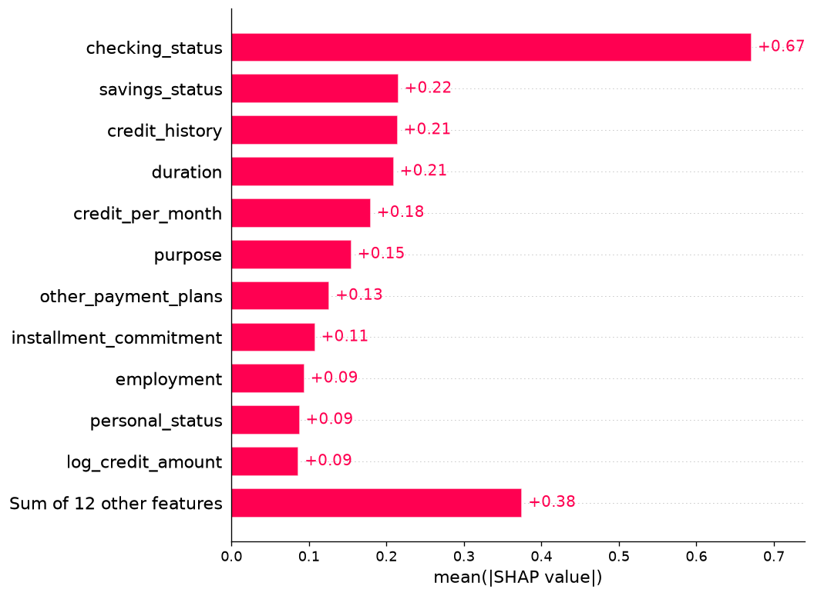
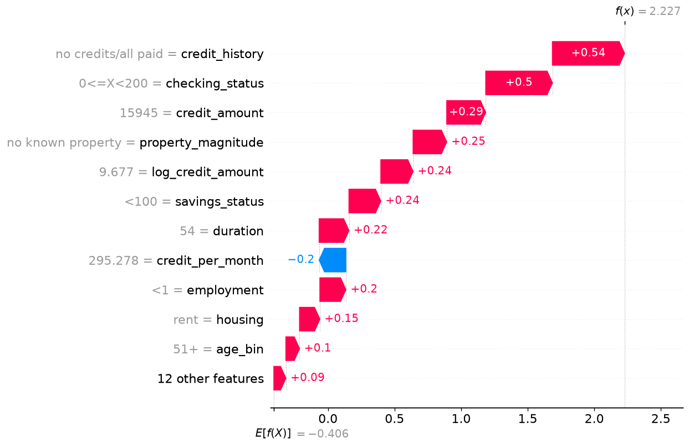
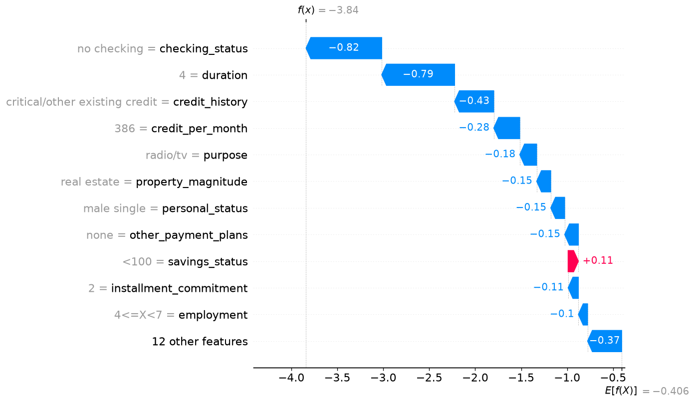

# SHAP notes (tuned-v1)

Working notes on how the registered CatBoost (`tuned-v1`) attributes a
score to features. Figures are regenerated with `make explain`; the
copies here are the ones worth keeping.

The sample is **200 rows from the 85 % rest pool**, seed 42. The sealed
test is closed: SHAP describes the model, it does not select it.

## Units

CatBoost categorical splits only work with TreeExplainer in
`tree_path_dependent` mode, which emits **log-odds** (the raw formula),
not P(bad).

```
base_value + Σ SHAP_i  =  raw score
P(bad) = sigmoid(raw score)
```

The base value on this fit is **−0.406**. That is the model's average
log-odds before looking at a row; sigmoid(−0.406) ≈ 0.40, in line with
the overstated mean P(bad) from training with `auto_class_weights=Balanced`.

A positive SHAP value pushes toward class `bad`. The sign reads the same
way as in probability space; the **units** do not. The payload
`/predict/explain` returns therefore carries `p_bad` next to
`"units": "log_odds"`.

## Global ranking



`checking_status` dominates (mean |SHAP| 0.67). The next three —
`savings_status`, `credit_history`, `duration` — sit around 0.21. The
derived `credit_per_month` (0.18) earns its keep; `log_credit_amount` is
further down. Age as a number barely shows; the binned `age_bin` is in
the remainder.

That ranking is what the model uses, not a causal ranking. Checking
account status is the strongest **association** in this 1000-row extract,
which matches every published analysis of German Credit I have seen.

## Two local waterfalls

The CLI picks the rest-pool row with the highest P(bad) and the one with
the lowest, so the plots are readable extremes, not typical applicants.

### High risk — id 96, P(bad) = 0.90 (label: bad)



Almost every bar is red. The largest pushes are `credit_history =
no credits/all paid` (+0.54) and `checking_status = 0<=X<200` (+0.50),
then a large loan (`credit_amount` 15 945 and its log) over 54 months,
thin savings, and no known property. The one blue bar is
`credit_per_month`: the monthly load is not what the model dislikes;
it is the size and the length.

`credit_amount` and `log_credit_amount` both appear. They are the same
signal twice; SHAP splits credit across correlated columns rather than
picking one. That is a limitation of the attribution, not a second
independent fact about the loan.

### Low risk — id 235, P(bad) = 0.02 (label: good)



Almost every bar is blue. `checking_status = no checking` (−0.82) and a
4-month duration (−0.79) do most of the work, then
`credit_history = critical/other existing credit`. In this extract those
labels are protective: “no checking account” and “other credits at this
bank” historically mark *better* risks, which is a quirk of German Credit
and not a policy I would ship without a domain review.

The only red bar in the top slice is `savings_status = <100`, and it is
small. The model is not finding hidden risk here; it is piling up
protective features.

## What this is not

- Not causality. Changing `duration` on an application does not move
  default risk by the SHAP of `duration`.
- Not the sealed test. These two ids are in the 85 %.
- Not probability-space SHAP. Interventional / `model_output="probability"`
  fails on CatBoost categoricals; I did not recode categories to integers
  to force it. Production scoring uses native `cat_features`, so
  explanations have to speak that language.
- Not a deployable policy. `personal_status` (gendered marital status)
  and `foreign_worker` are columns of this 1994 extract. They stay so
  the pipeline matches the published data; they are not attributes I
  would score on in a live EU credit model.

The per-row dict (`p_bad`, `base_value`, `units`, `contributions` sorted
by |SHAP|) is what `POST /predict/explain` returns.
