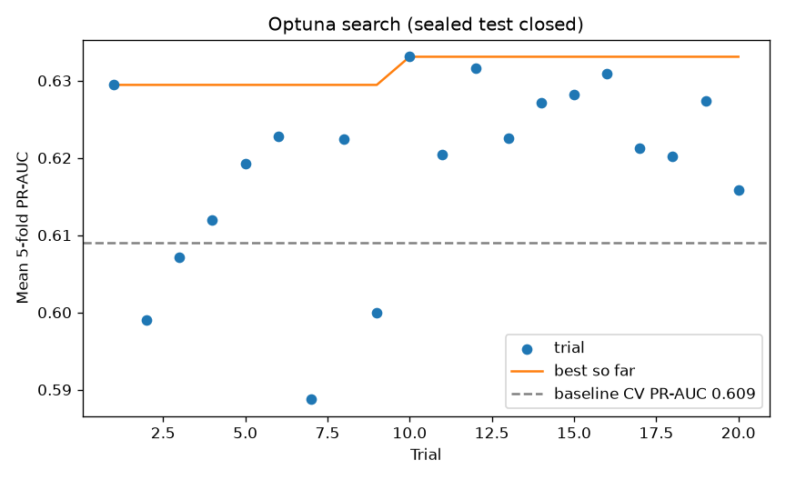
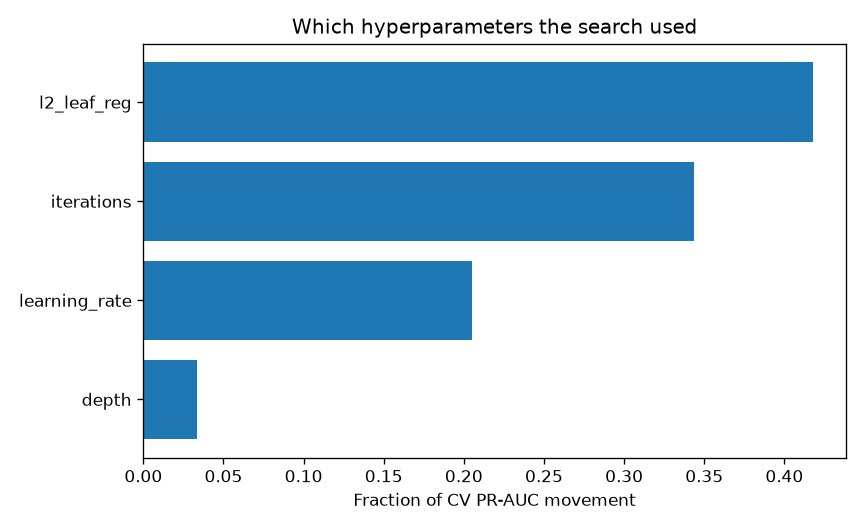
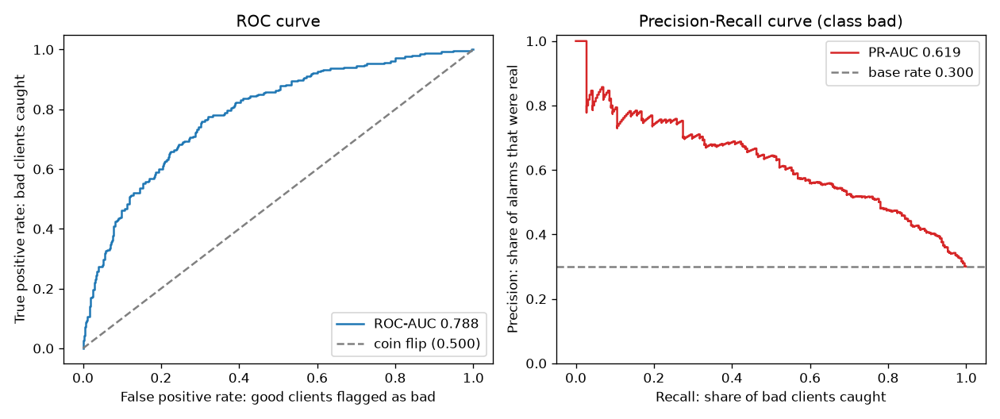
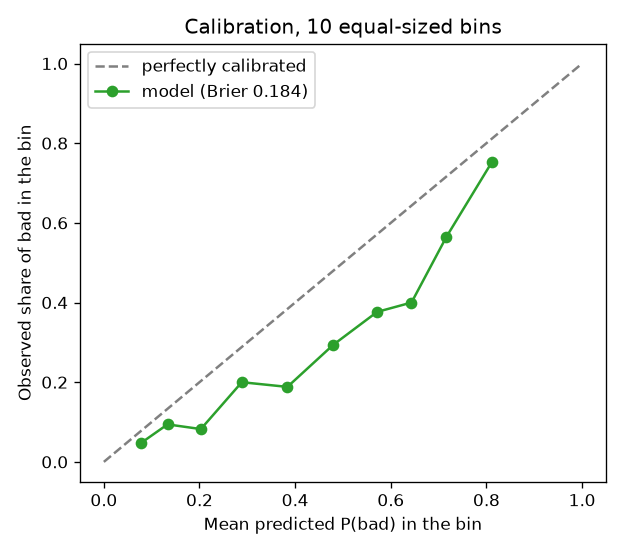
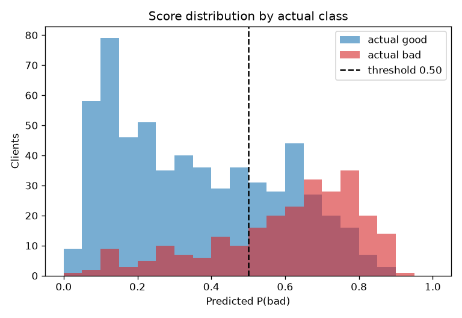
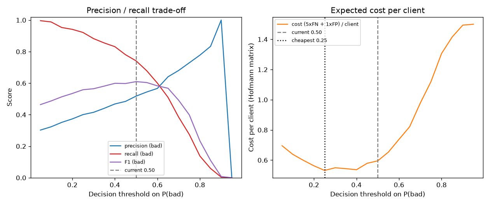

# Tuned-v1 evaluation notes

What changed when I searched hyperparameters, and what did not. Pair this
with the [baseline notes](baseline_evaluation.md): same protocol, same
sealed test, same operating point (0.5). The search was allowed to see
only mean 5-fold PR-AUC on the 85 % pool.

Figures are regenerated by `make tune` (Optuna) and `make evaluate`
(curves). The copies here are the ones worth keeping.

## The search

20 trials, TPE sampler, seed 42. Depth 3–6, learning rate 0.02–0.15
(log), iterations 150–400, L2 1–8 (log). Class weights stayed
`Balanced`; the seed stayed 42. I was not trying to fix calibration with
this search.

Winner: depth **4** (same as the baseline), learning rate **0.024**
(baseline 0.05), 350 iterations (baseline 300), L2 **2.50**.

Trial 1 already beat the baseline (0.629 vs 0.609). The winner is trial
10 (0.633). The next ten trials do not improve on it, and a few sit
*below* the grey line — 20 trials is enough to see that, and also enough
to see that a longer search would mostly fit the folds. That is why the
budget stayed small.

Almost all of the movement comes from L2, iterations and learning rate.
Depth barely matters (~0.03), which matches the winner keeping the
baseline's depth 4. The search did not find a different *tree shape*; it
found a slower, slightly more regularized version of the same model.

## Where the numbers moved

| Metric | Baseline CV | Tuned CV | Tuned test |
|---|---|---|---|
| ROC-AUC | 0.788 ± 0.024 | 0.792 ± 0.021 | 0.774 |
| PR-AUC (Optuna's objective) | 0.609 ± 0.047 | **0.633 ± 0.065** | 0.674 |
| Brier | 0.179 ± 0.004 | 0.184 ± 0.010 | 0.191 |
| Precision (`bad`) @ 0.5 | 0.543 ± 0.022 | 0.522 ± 0.033 | 0.500 |
| Recall (`bad`) @ 0.5 | 0.694 ± 0.078 | 0.741 ± 0.102 | 0.689 |
| Cost / client @ 0.5 | 0.635 ± 0.088 | 0.595 ± 0.111 | 0.673 |

Two readings of PR-AUC on the 85 % pool, and they are not the same:

- **Fold-mean 0.633** — average of five PR-AUCs, one per val fold. This
  is the Optuna objective, and what `registry.json` records under
  `cv_metrics`.
- **Pooled OOF 0.619** — one PR-AUC on all 850 out-of-fold scores. This
  is what the Precision-Recall figure below reports.

They differ because the metric is not linear in the rows. I keep both:
Optuna is allowed to see the fold-mean; the figure is the honest curve
on the concatenated scores.

Test PR-AUC went 0.692 → 0.674. With ~45 defaults that is inside the
noise of the CV standard deviation (0.065), so it does not veto the
winner. Selecting on the test would have broken the seal.

## Reading the tuned curves

Same four plots as the baseline, scored out-of-fold with the winner.

### Ranking

ROC-AUC is unchanged at 0.788 pooled (0.792 fold-mean). The PR curve is
the one that moved: pooled 0.619 against a 0.30 base rate, versus 0.595
on the baseline figure. A small lift in ranking of the class I care
about, not a different model.

### Calibration

Still below the diagonal. Mean predicted P(bad) is **0.431** against a
0.300 default rate — more inflated than the baseline's 0.405. Brier
moved 0.179 → 0.184, the wrong direction. That is expected: I left
`auto_class_weights=Balanced` on and asked Optuna for ranking, not for
honest probabilities. **Tuning did not buy a number the API can call a
probability.** Calibration stays a separate step.

### Where the errors live

The picture is the same shape with more mass pushed to the right, which
is the inflated scores showing up as a histogram. Good customers still
pile up below 0.2; defaulters still span the whole range; 0.3–0.6 is
still a grey band. A slower learning rate did not carve a gap that was
not there.

### Operating point

Hofmann's 5-to-1 matrix, same as the baseline. Cheapest cut is still
**0.25**. At the current 0.5 the tuned model is cheaper (0.595 vs
0.635) because recall went up. At 0.25 the picture flips: tuned costs
**0.532** per client against the baseline's **0.506**, because
precision on `bad` is a bit worse (0.40 vs 0.43) and the extra false
positives add up when you already catch 90 %+ of defaulters.

That is the honest limit of this search. Optuna maximised PR-AUC, not
Hofmann cost. Ranking improved; the cost-optimal threshold did not get
cheaper. If the product decision is "cut at 0.25 and minimise the
matrix", the baseline is the one to beat on *that* number, and this
winner does not.

| Cut | Baseline cost | Tuned cost | Tuned recall (`bad`) |
|---|---:|---:|---:|
| 0.25 (Hofmann cheapest) | 0.506 | 0.532 | 0.922 |
| 0.50 (current) | 0.635 | **0.595** | 0.741 |

I am not switching the threshold in this commit. The registry still
stores 0.5 plus `{fn: 5, fp: 1}`, so a later change is a policy edit,
not a retrain.

## What I am taking from this

1. **Keep `tuned-v1` as the scoring artifact.** It won on the metric the
   search was allowed to see. The test dip is noise; the cost at 0.5
   improved.
2. **Do not expect tuning to fix calibration.** Scores are more inflated
   than before. Platt / isotonic on OOF, or dropping `Balanced`, is
   still the next modelling step if `/predict` returns a probability.
3. **The 0.25 cut is still the Hofmann call, on either model.** Tuning
   did not move that optimum. It also did not make that cut cheaper.
4. **Stop searching.** Trial 10 was the peak; 20 was already past the
   point of diminishing returns on 850 rows.

SHAP, then the API. See [ROADMAP.md](../ROADMAP.md).
